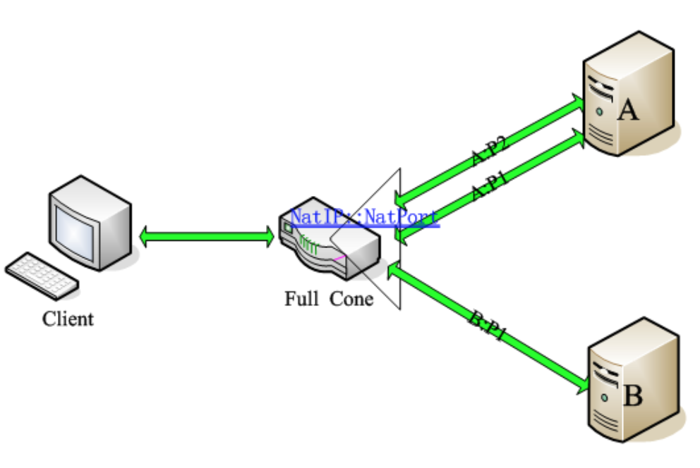
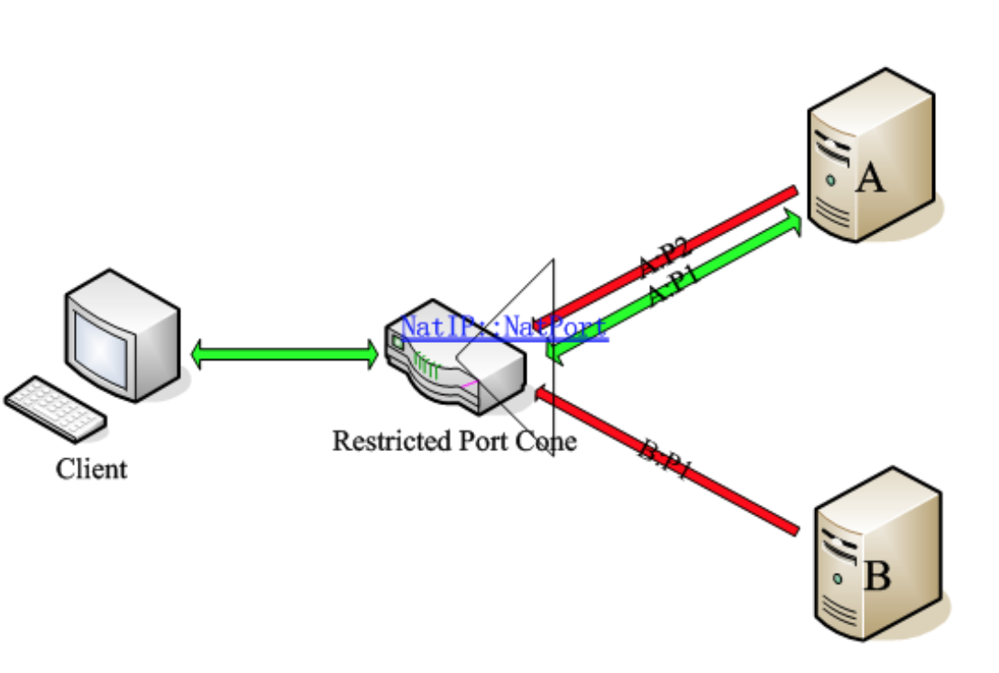
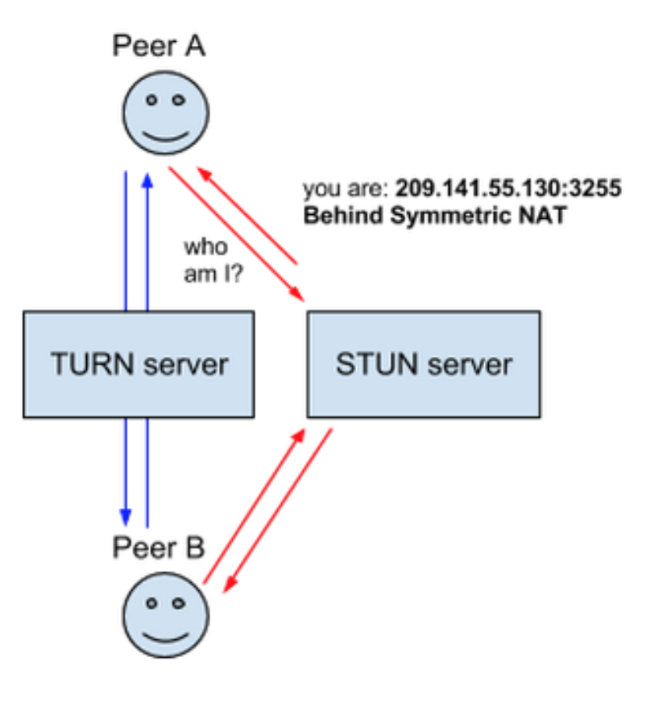

# P2P结构

p2p(peer to peer)可以定义成终端之间通过直接交换来共享计算机资源和服务,而无需经过服务器的中转.它的好处是显而易见的,不用服务器中转,不需要受限于服务器的带宽,而且大大减轻了服务器的压力.p2p的应用包括IM(qq，MSN),bittorrent等等.

p2p是一种对等的结构.和客户端服务器结构不同,并没有先后顺序,也不通过某个权威(中间人)进行中转,因此p2p无法使用tcp协议.如果你看过我写的html5攻略,其中有一节webrtc就是一个典型的p2p协议.从中我们可以看到p2p的基本形态

+ 每个节点都是单独的客户端
+ 客户端之间可以直连
+ 寻找客户端依靠一个叫STUN的服务器,STUN服务器只是类似信息交换墙的作用,而不负责中转信息


在讲实现前我们先来看几个概念:

+ NAT
+ 打洞
+ STUN

## NAT

NAT(Network Address Translation)是将IP数据包头中的IP地址转换为另一个IP地址的过程,通俗来讲,就是局域网公用一个public IP.我们可以很容易的检查到自己主机的ip地址和公网ip地址是不一致的,本机的ip地址可以使用`ifconfig(Unix)或ipconfig(windows)`查看,而公网的百度搜下`ip`就出来了.

那NAT是用来解决什么问题的？

上个世纪80年代,当时的人们在设计网络地址的时候,觉得再怎么样也不会有超过32bits位长即232台终端设备联入互联网,再加上增加ip的长度(即使是从4字节增到6字节)对当时设备的计算,存储,传输成本也是相当巨大的,想象当年的千年虫问题就是因为不存储年份的前两位导致的,现在想想,不就几个byte吗？我一顿饭不吃就省了好几个G了,但在当时的确是相当稀缺的资源.

后来逐渐发现IP地址不够用了,然后就NAT就诞生了！(虽然ipv6也是解决办法,但始终普及不开来).NAT的本质就是让一群机器公用同一个IP.这样就暂时解决了IP短缺的问题.其实NAT还有一个重要的用途，就是保护NAT内的主机不受外界攻击,因为公网与内网不管怎么样都有个NAT服务器阻隔着,这样要暴露的信息或者接口就可控了.

### NAT的类型

NAT的作用就是通过映射的方式为内网和公网打开通路,
假设路由器ip为`1.2.3.4`，公网服务器ip为`5.6.7.8`，内网机器`192.168.0.240:5060`首先发给路由器`1.2.3.4`,路由器分配一个端口，比如说`54333`，然后路由器代替内网机器发给服务器，即`1.2.3.4:54333 -> 5.6.7.8:80`,此时路由器会在映射表上留下一个"洞",来自`5.6.7.8:80`发送到`1.2.3.4:54333`的包都会转发到`192.168.0.250:5060`

但不是所有发往`1.2.3.4:54333`的包都会被转发过去,不同的NAT类型做同样的事情会有不同的方法

#### Full Cone全锥形NAT


IP,端口都不受限.只要客户端由内到外打通一个洞(`NatIP:NatPort -> A:P1`)之后，其他IP的主机(`B`)或端口(`A:P2`)都可以使用这个洞发送数据到客户端。



#### Restricted Cone受限锥形NAT


IP受限,端口不受限.当客户端由内到外打通一个洞(`NatIP:NatPort -> A:P1`)之后,A机器可以使用他的其他端口(`P2`)主动连接客户端,但B机器则不被允许.


#### Restricted Port Cone端口受限锥形NAT

IP,端口都受限.返回的数据只接受曾经打洞成功的对象(`A:P1`),由`A:P2`,`B:P1`发起的数据将不被`NatIP:NatPort`接收.


#### Symmetric NAT对称型NAT

对称型NAT具有端口受限锥型的受限特性.但更重要的是,他对每个外部主机或端口的会话都会映射为不同的端口(洞).只有来自相同的内部地址(`IP:PORT`)并且发送到相同外部地址(`X:x`)的请求,在NAT上才映射为相同的外网端口,即相同的映射.

举个例子：

1. client访问`A:p1`是这样的路径：`Client --> NatIP:Pa1 --> A:P1`
2. client访问`A:p2`是这样的路径：`Client --> NatIP:Pa2 --> A:P2`

(而在前面的三种NAT中，只要client不变，那么留在路由器上的“洞”就不会变，symmetric NAT会变，端口变)


### 怎么确定自己的NAT类型


为什么要知道自己的NAT类型？这为之后的打洞做准备.RFC专门定义了一套协议来做这件事(RFC 5389),这个协议的名字叫STUN(Session Traversal Utilities for NAT),它的算法输出是:

+ Public ip and port
+ 防火墙是否设置
+ 是否在NAT之后以及NAT的类型

我们可以使用[pystun](https://github.com/jtriley/pystun)来查看自己的的NAT,不过由于年久失修,这个项目止步于python2.


```python
import stun
nat_type, external_ip, external_port = stun.get_ip_info()
```


```python
nat_type
```


    'Symmetric NAT'


```python
external_ip
```


    '183.14.29.211'


```python
external_port 
```


    22168


## "打洞"


既然有NAT守关,那么我们如何才能够直接和远端通信呢?这就需要所谓的`打洞`.

> 问题也就归结为:有两个需要互联的`client A`和`client B`,如何让他们可以互联

方案：

1. A,B分别与stun server交互获得自己的NAT类型

+ A,B连接一个公网服务器(turn server，RFC5766),把自己的NAT发给turn server，此时turn server发现A和B想要互连，把对方的ip，port，NAT类型发给对方
Client根据自身NAT类型做出相应的策略。

+ Client根据自身NAT类型做出相应的策略。

    
    + 如果有一方为Symmetric NAT

    因为每一次连接端口都不一样,所以对方无法知道在对称NAT的client下次用什么端口.无法完全实现p2p传输(预测端口除外),需要turn server做一个relay,即所有消息通过turn server转发.

    + 如果有一方是Full Cone
    
    一方通过与full cone的一方的public ip和port直接与full cone通信,实现了p2p通信.

    + 如果有一方是受限型NAT(两种)

    受限型一方向对方发送“打洞包”,比如”punching…”,对方收到后回复一个指定的命令,比如”end punching”,通信开始.这样做理由:受限型一方需要让`IPA:portA`的包进入，需要先向`IPA：portA`发包.实现了p2p通信.
    


我们通过上述的讨论可知，symmetric NAT好像不能实现p2p啊？其实不然，能实现，但代价太高，这个方法叫端口预测.

基本思路：

A向B的所有port(0~65535)发包，让路由器知道来自B的所有端口都转发到A
B向A的所有port(0~65535)发包，让路由器知道来自A的所有端口都转发到B
于是连接完成了

## STUN

stun是一套专门用于

以上内容参考自<http://lifeofzjs.com/blog/2014/07/19/how-p2p-in-symmetric-nat/>感谢作者的科普.
